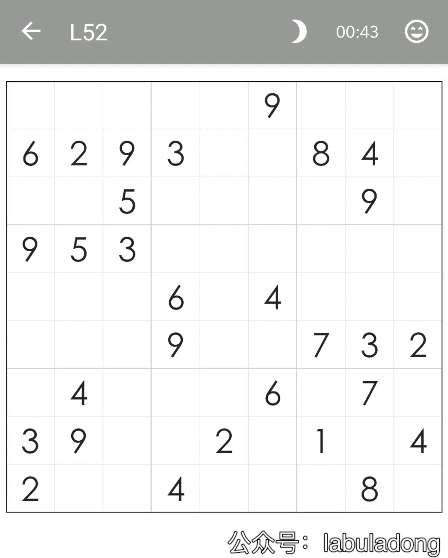
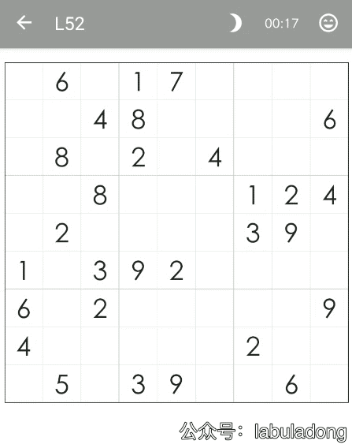

# 回溯算法最佳实践：解数独

<p align='center'>
<a href="https://github.com/labuladong/fucking-algorithm" target="view_window"></a>
<a href="https://www.zhihu.com/people/labuladong"></a>
<a href="https://i.loli.net/2020/10/10/MhRTyUKfXZOlQYN.jpg"></a>
<a href="https://space.bilibili.com/14089380"></a>
</p>

相关推荐：

- [双指针技巧总结](https://labuladong.gitbook.io/algo/shu-ju-jie-gou-xi-lie/2.5-shou-ba-shou-shua-shu-zu-ti-mu/shuang-zhi-zhen-ji-qiao)
- [回溯算法团灭子集、排列、组合问题](https://labuladong.gitbook.io/algo/suan-fa-si-wei-xi-lie/3.1-hui-su-suan-fa-dfs-suan-fa-pian/zi-ji-pai-lie-zu-he)

读完本文，你不仅学会了算法套路，还可以顺便去 LeetCode 上拿下如下题目：

[37.解数独（困难）](https://leetcode-cn.com/problems/sudoku-solver)

经常拿回溯算法来说事儿的，无非就是八皇后问题和数独问题了。那我们今天就通过**实际且有趣的例子**来讲一下如何用回溯算法来解决数独问题。

## **一、直观感受**

说实话我小的时候也尝试过玩数独游戏，但从来都没有完成过一次。做数独是有技巧的，我记得一些比较专业的数独游戏软件，他们会教你玩数独的技巧，不过在我看来这些技巧都太复杂，我根本就没有兴趣看下去。

不过自从我学习了算法，多困难的数独问题都拦不住我了。下面是我用程序完成数独的一个例子：



PS：GIF 可能出现 bug，若卡住点开查看即可，下同。

这是一个安卓手机中的数独游戏，我使用一个叫做 Auto.js 的脚本引擎，配合回溯算法来实现自动完成填写，并且算法记录了执行次数。**在后文，我会给出该脚本的实现思路代码以及软件工具的下载，你也可以拿来装逼用**。

可以观察到前两次都执行了 1 万多次，而最后一次只执行了 100 多次就算出了答案，这说明对于不同的局面，回溯算法得到答案的时间是不相同的。

那么计算机如何解决数独问题呢？其实非常的简单，就是穷举嘛，下面我可视化了求解过程：


**算法的核心思路非常非常的简单，就是对每一个空着的格子穷举 1 到 9，如果遇到不合法的数字（在同一行或同一列或同一个 3×3 的区域中存在相同的数字）则跳过，如果找到一个合法的数字，则继续穷举下一个空格子**。

对于数独游戏，也许我们还会有另一个误区：就是下意识地认为如果给定的数字越少那么这个局面的难度就越大。

这个结论对人来说应该没毛病，但对于计算机而言，给的数字越少，反而穷举的步数就越少，得到答案的速度越快，至于为什么，我们后面探讨代码实现的时候会讲。

上一个 GIF 是最后一关 70 关，下图是第 52 关，数字比较多，看起来似乎不难，但是我们看一下算法执行的过程：



可以看到算法在前两行穷举了半天都没有走出去，由于时间原因我就没有继续录制了，事实上，这个局面穷举的次数大概是上一个局面的 10 倍。

**言归正传，下面我们就来具体探讨一下如何用算法来求解数独问题，顺便说说我是如何可视化这个求解过程的**。

## **二、代码实现**

首先，我们不用管游戏的 UI，先单纯地解决回溯算法，LeetCode 第 37 题就是解数独的问题，算法函数签名如下：

```
void solveSudoku(char[][] board);
```

输入是一个9x9的棋盘，空白格子用点号字符 `.` 表示，算法需要在原地修改棋盘，将空白格子填上数字，得到一个可行解。

至于数独的要求，大家想必都很熟悉了，每行，每列以及每一个 3×3 的小方格都不能有相同的数字出现。那么，现在我们直接套回溯框架即可求解。

**前文**[**回溯算法详解**](https://labuladong.gitbook.io/algo/suan-fa-si-wei-xi-lie/3.1-hui-su-suan-fa-dfs-suan-fa-pian/hui-su-suan-fa-xiang-jie-xiu-ding-ban)**，已经写过了回溯算法的套路框架，如果还没看过那篇文章的，建议先看看**。

回忆刚才的 GIF 图片，我们求解数独的思路很简单粗暴，就是对每一个格子所有可能的数字进行穷举。对于每个位置，应该如何穷举，有几个选择呢？**很简单啊，从 1 到 9 就是选择，全部试一遍不就行了**：

```java
// 对 board[i][j] 进行穷举尝试
void backtrack(char[][] board, int i, int j) {
    int m = 9, n = 9;
    for (char ch = '1'; ch <= '9'; ch++) {
        // 做选择
        board[i][j] = ch;
        // 继续穷举下一个
        backtrack(board, i, j + 1);
        // 撤销选择
        board[i][j] = '.';
    }
}
```

emmm，再继续细化，并不是 1 到 9 都可以取到的，有的数字不是不满足数独的合法条件吗？而且现在只是给 `j` 加一，那如果 `j` 加到最后一列了，怎么办？

**很简单，当** **`j`** **到达超过每一行的最后一个索引时，转为增加** **`i`** **开始穷举下一行，并且在穷举之前添加一个判断，跳过不满足条件的数字**：

```java
void backtrack(char[][] board, int i, int j) {
    int m = 9, n = 9;
    if (j == n) {
        // 穷举到最后一列的话就换到下一行重新开始。
        backtrack(board, i + 1, 0);
        return;
    }

    // 如果该位置是预设的数字，不用我们操心
    if (board[i][j] != '.') {
        backtrack(board, i, j + 1);
        return;
    } 

    for (char ch = '1'; ch <= '9'; ch++) {
        // 如果遇到不合法的数字，就跳过
        if (!isValid(board, i, j, ch))
            continue;

        board[i][j] = ch;
        backtrack(board, i, j + 1);
        board[i][j] = '.';
    }
}

// 判断 board[i][j] 是否可以填入 n
boolean isValid(char[][] board, int r, int c, char n) {
    for (int i = 0; i < 9; i++) {
        // 判断行是否存在重复
        if (board[r][i] == n) return false;
        // 判断列是否存在重复
        if (board[i][c] == n) return false;
        // 判断 3 x 3 方框是否存在重复
        if (board[(r/3)*3 + i/3][(c/3)*3 + i%3] == n)
            return false;
    }
    return true;
}
```

emmm，现在基本上差不多了，还剩最后一个问题：这个算法没有 base case，永远不会停止递归。这个好办，什么时候结束递归？**显然** **`r == m`** **的时候就说明穷举完了最后一行，完成了所有的穷举，就是 base case**。

另外，前文也提到过，为了减少复杂度，我们可以让 `backtrack` 函数返回值为 `boolean`，如果找到一个可行解就返回 true，这样就可以阻止后续的递归。只找一个可行解，也是题目的本意。

最终代码修改如下：

```java
boolean backtrack(char[][] board, int i, int j) {
    int m = 9, n = 9;
    if (j == n) {
        // 穷举到最后一列的话就换到下一行重新开始。
        return backtrack(board, i + 1, 0);
    }
    if (i == m) {
        // 找到一个可行解，触发 base case
        return true;
    }

    if (board[i][j] != '.') {
        // 如果有预设数字，不用我们穷举
        return backtrack(board, i, j + 1);
    } 

    for (char ch = '1'; ch <= '9'; ch++) {
        // 如果遇到不合法的数字，就跳过
        if (!isValid(board, i, j, ch))
            continue;

        board[i][j] = ch;
        // 如果找到一个可行解，立即结束
        if (backtrack(board, i, j + 1)) {
            return true;
        }
        board[i][j] = '.';
    }
    // 穷举完 1~9，依然没有找到可行解，此路不通
    return false;
}

boolean isValid(char[][] board, int r, int c, char n) {
    // 见上文
}
```

**现在可以回答一下之前的问题，为什么有时候算法执行的次数多，有时候少？为什么对于计算机而言，确定的数字越少，反而算出答案的速度越快**？

我们已经实现了一遍算法，掌握了其原理，回溯就是从 1 开始对每个格子穷举，最后只要试出一个可行解，就会立即停止后续的递归穷举。所以暴力试出答案的次数和随机生成的棋盘关系很大，这个是说不准的。

那么你可能问，**既然运行次数说不准，那么这个算法的时间复杂度是多少呢**？

对于这种时间复杂度的计算，我们只能给出一个最坏情况，也就是 O(9^M)，其中 `M` 是棋盘中空着的格子数量。你想嘛，对每个空格子穷举 9 个数，结果就是指数级的。

这个复杂度非常高，但稍作思考就能发现，实际上我们并没有真的对每个空格都穷举 9 次，有的数字会跳过，有的数字根本就没有穷举，因为当我们找到一个可行解的时候就立即结束了，后续的递归都没有展开。

这个 O(9^M) 的复杂度实际上是完全穷举，或者说是找到**所有**可行解的时间复杂度。

如果给定的数字越少，相当于给出的约束条件越少，对于计算机这种穷举策略来说，是更容易进行下去，而不容易走回头路进行回溯的，所以说**如果仅仅找出一个可行解**，这种情况下穷举的速度反而比较快。

至此，回溯算法就完成了，你可以用以上代码通过 LeetCode 的判题系统，下面我们来简单说下我是如何把这个回溯过程可视化出来的。

## **三、算法可视化**

让算法帮我玩游戏的核心是算法，如果你理解了这个算法，剩下就是借助安卓脚本引擎 Auto.js 调 API 操作手机了，工具我都放在后台了，你等会儿就可以下载。

用伪码简单说下思路，我可以写两个函数：

```java
void setNum(Button b, char n) {
    // 输入一个方格，将该方格设置为数字 n
}

void cancelNum(Button b) {
    // 输入一个方格，将该方格上的数字撤销
}
```

回溯算法的核心框架如下，**只要在框架对应的位置加上对应的操作，即可将算法做选择、撤销选择的过程完全展示出来**，也许这就是套路框架的魅力所在：

```java
for (char ch = '1'; ch <= '9'; ch++) {
    Button b = new Button(r, c);
    // 做选择
    setNum(b, ch);
    board[i][j] = ch;
    // 继续穷举下一个
    backtrack(board, i, j + 1)
    // 撤销选择
    cancelNum(b);
    board[i][j] = '.';
}
```

以上思路就可以模拟出算法穷举的过程：


